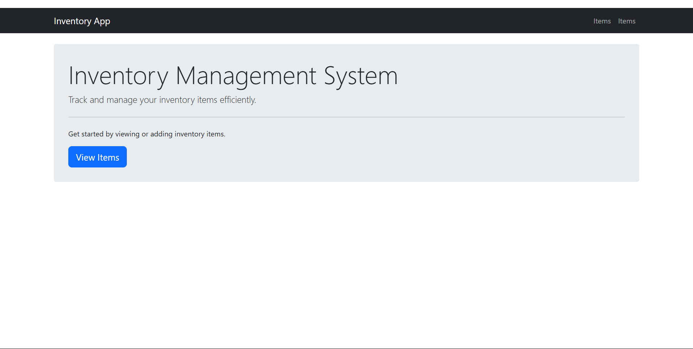
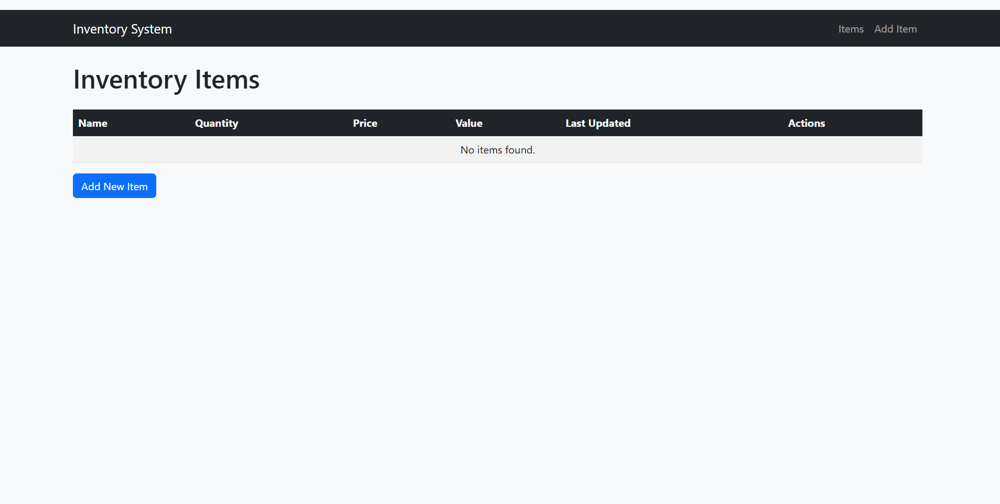
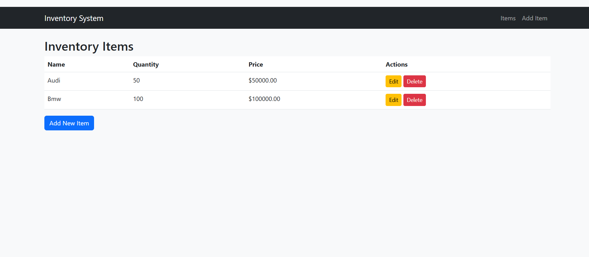

# 📦 Inventory Management System


A full-featured inventory management system built with Django and Bootstrap for tracking products, stock levels, and inventory value with comprehensive reporting.

## ✨ Features

- **Product Management**
  - 📦 Complete product catalog
  - 🔍 Detailed product information
  - 🏷️ Category organization

- **Inventory Control**
  - 🔢 Real-time stock level tracking
  - 📈 Inventory value calculation
  - 📊 Low stock alerts

- **User System**
  - 👤 Role-based authentication
  - 🔒 Admin-only access control
  - 📝 Activity logging

- **Operations**
  - ✅ Full CRUD functionality
  - 📤 CSV import/export
  - 📑 Basic reporting

## 🚀 Quick Start

### Prerequisites

- Python 3.8+
- pip
- Virtualenv (recommended)

## 📸 Screenshots

### Main Dashboard


### Product Management
| Feature | Screenshot |
|---------|------------|
| Add New Item |  |
| Inventory Report |  |

### Installation

```bash
 Clone the repository
git clone https://github.com/Nighthawk7792/Inventory-Management-System.git
cd Inventory-Management-System

# Create and activate virtual environment
python -m venv venv

# Windows
.\venv\Scripts\activate

# Mac/Linux
source venv/bin/activate

# Install dependencies
pip install -r requirements.txt

# Set up database
python manage.py migrate

# Create admin user
python manage.py createsuperuser
🖥️ Usage
bash
Copy
# Start development server
python manage.py runserver
Access the application at:

Main interface: http://localhost:8000

Admin panel: http://localhost:8000/admin

Default test credentials (if using sample data):

Username: admin

Password: admin123

📂 Project Structure
Copy
Inventory-Management-System/
├── inventory/          # Project configuration
│   ├── settings.py     # Django settings
│   └── urls.py         # Main URLs
├── items/              # Inventory app
│   ├── migrations/     # Database migrations
│   ├── templates/      # HTML templates
│   ├── admin.py        # Admin config
│   ├── models.py       # Data models
│   ├── views.py        # Business logic
│   └── urls.py         # App URLs
├── templates/          # Base templates
├── static/             # CSS/JS assets
├── manage.py           # Django CLI
└── requirements.txt    # Python dependencies
🛠️ Troubleshooting
Issue: Database not updating

bash
Copy
python manage.py makemigrations
python manage.py migrate
Issue: Port conflict

bash
Copy
python manage.py runserver 8001
Issue: Reset database (development only)

bash
Copy
rm db.sqlite3
python manage.py migrate
🤝 Contributing
Fork the repository

Create your feature branch (git checkout -b feature/AmazingFeature)

Commit your changes (git commit -m 'Add some AmazingFeature')

Push to the branch (git push origin feature/AmazingFeature)

Open a Pull Request


